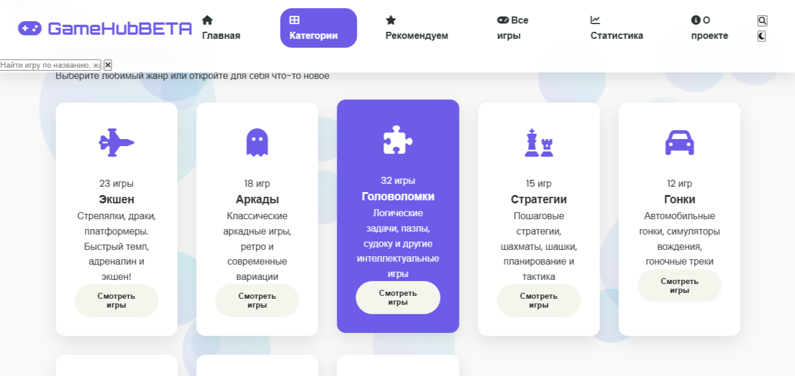

# 🎮 GameHub - HTML5 Игровая Платформа



**GameHub** — это открытая коллекция HTML5 игр, созданных на чистом HTML, CSS и JavaScript. Все игры работают прямо в браузере, не требуют установки и полностью бесплатны.

___

## ✨ Особенности

- 🎯 ** N+ игр** в различных категориях
- 🚀 **Мгновенный запуск** — без регистрации и скачивания
- 📱 **Полностью адаптивный** дизайн для всех устройств
- 🎨 **Современный интерфейс** с анимациями и эффектами
- 🔍 **Умный поиск** по играм и категориям
- ⭐ **Система рейтингов** и рекомендаций
- 💾 **Избранное** — сохраняйте любимые игры
- 📊 **Статистика** игр и платформы

____

## 🚀 Быстрый старт

### Для игроков:
1. **Перейдите на сайт**: [https://username.github.io/gamehub](https://Gabryelf.github.io/Astra)
2. **Выберите категорию** или используйте поиск
3. **Нажмите на игру** для просмотра деталей
4. **Кликните "Играть"** и наслаждайтесь!


____

## 🎮 Категории игр

| Категория | 🎯 Описание | 📈 Количество игр |
|-----------|-------------|-------------------|
| 🚀 **Экшен** | Стрелялки, драки, платформеры | 23 игры |
| 👻 **Аркады** | Классические и ретро-игры | 18 игр |
| 🧩 **Головоломки** | Логические задачи и пазлы | 32 игры |
| ♟️ **Стратегии** | Шахматы, шашки, тактические игры | 15 игр |
| 🏎️ **Гонки** | Автосимуляторы и гонки | 12 игр |
| ⚽ **Спорт** | Спортивные симуляторы | 10 игр |
| 📱 **Казуальные** | Игры для коротких сессий | 28 игр |
| 🎓 **Образовательные** | Обучающие игры и задачи | 14 игр |

_____

## 🛠️ Технологии

- **Frontend**: HTML5, CSS3, JavaScript (ES6+)
- **Стили**: CSS Grid, Flexbox, CSS Custom Properties
- **Анимации**: CSS Animations, Transitions
- **Хостинг**: GitHub Pages
- **Оптимизация**: Lazy Loading, Image Optimization

____

## 🎨 Дизайн системы

### Цветовая палитра
```css
--primary: #6c5ce7      /* Основной фиолетовый */
--secondary: #a29bfe    /* Вторичный фиолетовый */
--accent: #00cec9       /* Акцентный бирюзовый */
--dark: #2d3436         /* Тёмный текст */
--light: #f9f9f9        /* Светлый фон */
--success: #00b894      /* Успех */
--warning: #fdcb6e      /* Предупреждение */
--danger: #e17055       * Ошибка */
```

### Шрифты
- **Заголовки**: Orbitron (технологичный, игровой)
- **Основной текст**: Poppins (чистый, современный)
- **Моноширинный**: Courier New (для кода)

_____

## 📱 Адаптивный дизайн

- **Desktop**: 1200px+ (4-6 колонок)
- **Tablet**: 768px-1199px (3-4 колонки)
- **Mobile**: 320px-767px (1-2 колонки)
- **Touch-friendly**: Большие кнопки, удобные тапы

____

## 🎯 Рекомендации для разработчиков игр

### Оптимизация производительности:
- Используйте requestAnimationFrame для анимаций
- Оптимизируйте изображения (WebP, сжатие)
- Минифицируйте CSS и JavaScript
- Используйте lazy loading для ресурсов

### Лучшие практики:
- **Размер игры**: старайтесь уложиться в 5-10MB
- **Управление**: поддерживайте клавиатуру и мышь/тач
- **Состояние**: сохраняйте прогресс в localStorage
- **Доступность**: добавляйте alt-тексты и ARIA-атрибуты
- **Кроссбраузерность**: тестируйте в Chrome, Firefox, Safari


_____

## 📊 Статистика и аналитика

### Встроенная статистика:
- Количество запусков игры
- Лайки и рейтинги
- Время игры
- Популярность по категориям

### Google Analytics:
```html
<!-- Добавить в head -->
<script async src="https://www.googletagmanager.com/gtag/js?id=G-XXXXXXX"></script>
<script>
  window.dataLayer = window.dataLayer || [];
  function gtag(){dataLayer.push(arguments);}
  gtag('js', new Date());
  gtag('config', 'G-XXXXXXX');
</script>
```

_____

## 🔄 Развитие проекта

### Планируемые функции:
1. **Аккаунты пользователей** (сохранение прогресса, избранное)
2. **Мультиплеерные игры** (онлайн-режим)
3. **Система достижений** (бейджи, награды)
4. **Рейтинги лидеров** (топ игроков)
5. **Редактор игр** (визуальный конструктор)
6. **Мобильное приложение** (PWA)
7. **API для разработчиков** (добавление игр через API)

### Контрибьютинг:
1. **Сообщить об ошибке**: Issues
2. **Предложить функцию**: Discussions
3. **Добавить игру**: Pull Request
4. **Улучшить код**: Code Review
5. **Помочь с документацией**: Wiki

_____

## 🙏 Благодарности

### Технологии и инструменты:
- [GitHub Pages](https://pages.github.com) — за бесплатный хостинг
- [Font Awesome](https://fontawesome.com) — за иконки
- [Google Fonts](https://fonts.google.com) — за шрифты
- [CanIUse](https://caniuse.com) — за информацию о поддержке

---

**Присоединяйтесь к нашему сообществу и создавайте удивительные игры вместе с нами!** 🎉

---


